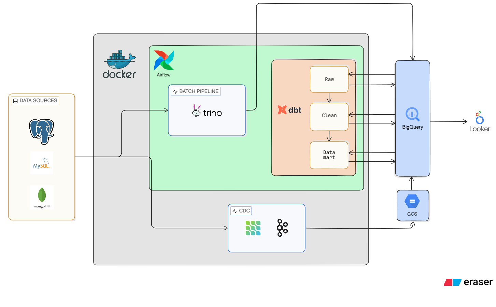

# 🚕 Taxi Ride Hailing

A **end-to-end data engineering playground** that simulates a ride-hailing platform — from synthetic data generation all the way to analytics-ready Gold marts in BigQuery.

The project is intentionally self-contained: spin up the Docker Compose stacks, register the Kafka Connect connectors, trigger the Airflow DAGs, and you have a fully running modern data stack on VPS.

---
