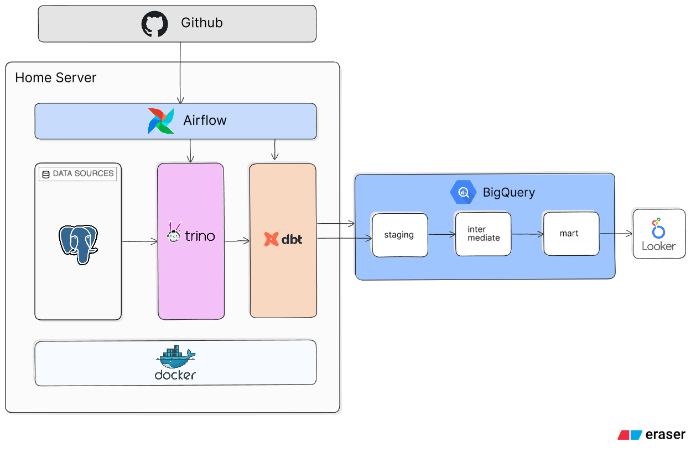
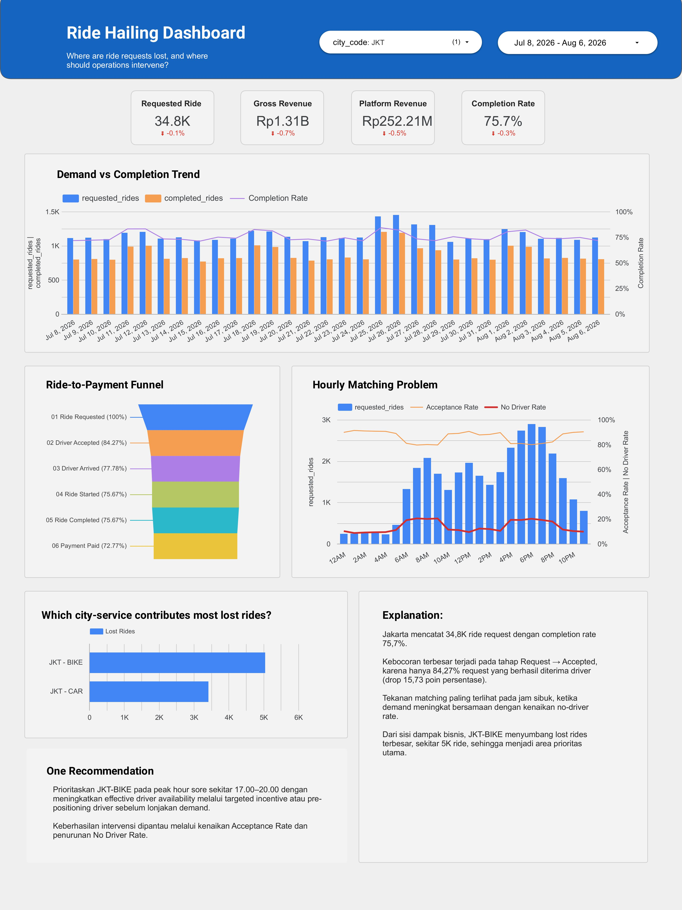
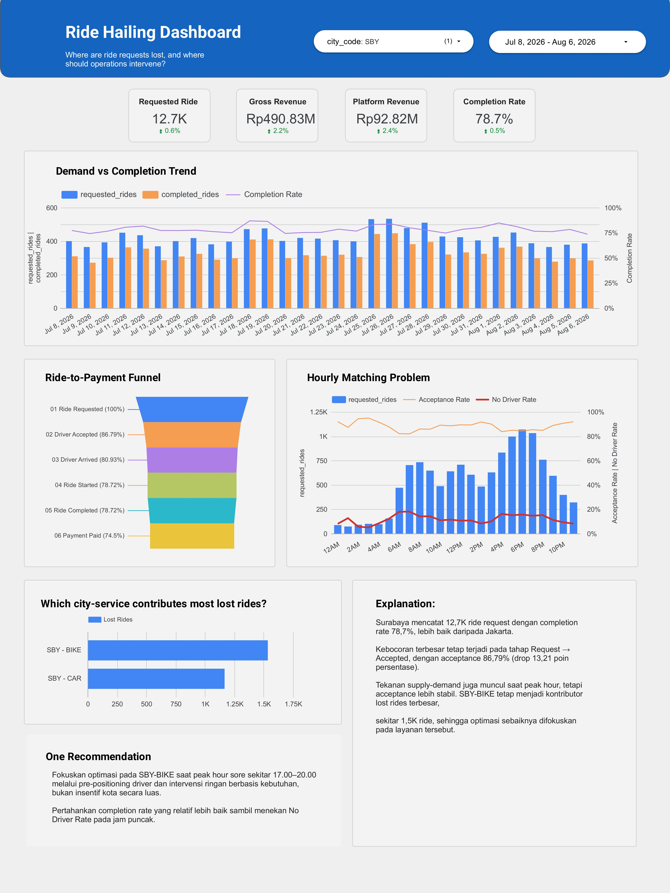

# Ride-Hailing Analytics Data Platform

End-to-end analytics pipeline for ride demand, matching performance, ride completion, revenue, and driver operations using PostgreSQL, Airflow, Trino, BigQuery, dbt, and Looker Studio.

## Overview

This project simulates a ride-hailing operational system and builds an analytics pipeline from transactional PostgreSQL data to dashboard-ready marts in BigQuery.

The pipeline is designed around mutable ride and payment records. Recent records are reprocessed using configurable lookback windows so late status changes can be captured without reloading the full dataset.

## Architecture

<p align="center">
  
</p>

PostgreSQL, Trino, Airflow, and dbt run as Dockerized services on a **home server**. Airflow and Trino are exposed only through the server's **Tailscale network**, while BigQuery and Looker Studio remain managed cloud services. GitHub Actions deploys changes through a self-hosted runner.

> The diagram is intentionally simplified. The ingestion pipeline lands source data in a BigQuery raw layer before dbt builds staging, intermediate, fact/dimension, and mart models.

## Tech Stack

| Layer | Technology |
|---|---|
| Data Source | PostgreSQL 16, Python synthetic data generator |
| Orchestration | Apache Airflow 3.3 |
| Query / Ingestion | Trino 477 |
| Data Warehouse | Google BigQuery |
| Transformation | dbt Core + dbt-bigquery |
| BI | Looker Studio |
| Runtime | Docker Compose, home server |
| Private Network | Tailscale |
| CI/CD | GitHub Actions, GHCR, self-hosted runner |

## Data Flow

1. A Python generator creates historical and realtime ride-hailing data in PostgreSQL.
2. Airflow starts the ingestion pipeline daily at **01:00 Asia/Jakarta**.
3. Trino reads PostgreSQL and writes source records into temporary BigQuery tables.
4. BigQuery `MERGE` statements deduplicate and upsert records into the raw layer.
5. dbt runs daily at **02:00 Asia/Jakarta** and builds staging, intermediate, dimensions, facts, and analytics marts.
6. Looker Studio reads the aggregate marts directly for reporting.

Reference tables such as cities and zones use full extraction. Mutable master data uses a **2-day `updated_at` lookback**, while rides and payments use a **7-day lookback** to capture late lifecycle and payment updates.

## Data Modeling

Dashboard logic is pushed into dbt models so the BI layer remains relatively thin.

| Model | Purpose |
|---|---|
| `fct_rides` | Ride-level lifecycle, payment, revenue, driver, location, and business-time data |
| `agg_daily_city_service` | Daily demand, completion, cancellation, matching, and revenue KPIs |
| `agg_hourly_city_service` | Hourly marketplace and peak-hour performance |
| `agg_ride_funnel_steps_daily` | Ride-to-payment funnel and lifecycle drop-off |
| `agg_driver_performance_daily` | Driver assignment, completion, arrival, and earnings performance |

`fct_rides` uses incremental `MERGE` by `ride_id` and is partitioned by request date. Aggregate marts use `insert_overwrite` to rebuild only affected business-date partitions.

## Engineering Highlights

- **Idempotent ingestion** — source rows are deduplicated before BigQuery `MERGE` using business keys and source update timestamps.
- **Late-arriving updates** — configurable lookback windows reprocess recently changed rides and payments instead of assuming append-only data.
- **Business-time handling** — source timestamps are stored in UTC and dbt exposes both UTC and `Asia/Jakarta` fields for analytics.
- **BigQuery optimization** — fact and mart tables use date partitioning and clustering on commonly filtered dimensions.
- **Data quality** — dbt tests validate grain, relationships, lifecycle timestamp order, date keys, fares, and timezone consistency.
- **Environment isolation** — development and production use separate runtime directories, datasets, and GitHub environments.

## CI/CD

GitHub Actions separates application changes from runtime-image changes:

- Airflow DAG changes are validated with `DagBag` before deployment.
- Airflow dependency changes build and publish a new runtime image to GHCR.
- dbt changes run dependency installation and parsing before the project is synced.
- Platform and Trino configuration changes are validated before deployment to the home server.
- Deployment jobs run on a **self-hosted GitHub Actions runner**.

This keeps routine DAG and SQL changes independent from unnecessary container rebuilds.

## Dashboard

The Looker Studio dashboard focuses on one operational question:

**Where are ride requests lost, and where should operations intervene?**

It combines demand, revenue, ride-to-payment funnel conversion, hourly matching pressure, acceptance rate, no-driver rate, and lost rides by city-service.

**[View Interactive Dashboard](https://datastudio.google.com/reporting/c90727ac-6540-4772-a462-0edec4b0db9f)**

<p align="center">
  
  
</p>

The dashboard first identifies the largest loss in the ride funnel, then uses hourly demand and city-service contribution to narrow the operational priority.

## Project Structure

```text
.
├── airflow/
│   └── dags/                 # ingestion and dbt orchestration
├── dbt/
│   └── project/
│       ├── models/           # staging, intermediate, dimensions, facts, marts
│       ├── macros/
│       └── tests/
├── generator/                # historical and realtime synthetic data
├── postgres-source/          # PostgreSQL source schema and migrations
├── trino/                    # PostgreSQL and BigQuery connectors
├── deploy/                   # Docker Compose runtime
├── .github/workflows/        # CI/CD workflows
└── images/                   # architecture and dashboard previews
```

## Repository Notes

Secrets, runtime `.env` files, and GCP service-account credentials are intentionally excluded from version control.
